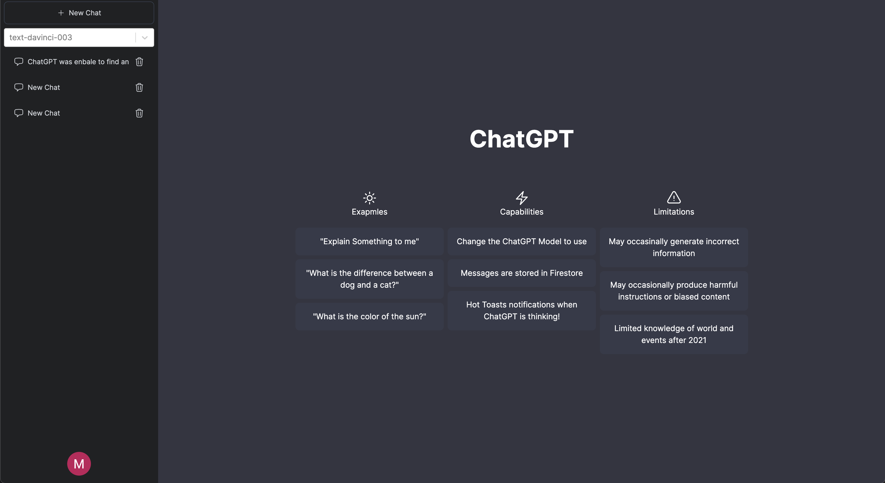
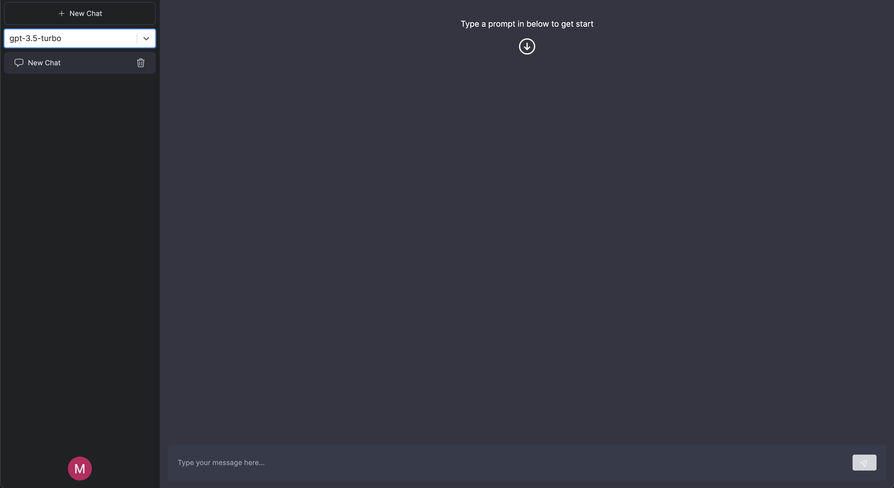

# ChatGPT Messenger




This is a [Next.js 13.4.2](https://nextjs.org/) project bootstrapped with

* [create-next-app](https://github.com/vercel/next.js/tree/canary/packages/create-next-app)
* Firebase & Firebase-Admin
* [NextAuth](https://next-auth.js.org/)
* [react-hook-form](https://react-hook-form.com/)
* [react-hot-toast](https://react-hot-toast.com/docs)
* [react-firebase-hooks](https://www.npmjs.com/package/react-firebase-hooks)
* [react-select](https://react-select.com/home)
* OpenAI API
* [React Hooks for Data Fetching – SWR](https://swr.vercel.app/)

## Getting Started

First, run the development server:

```bash
npm run dev
```

Open [http://localhost:3000](http://localhost:3000) with your browser to see the result.
